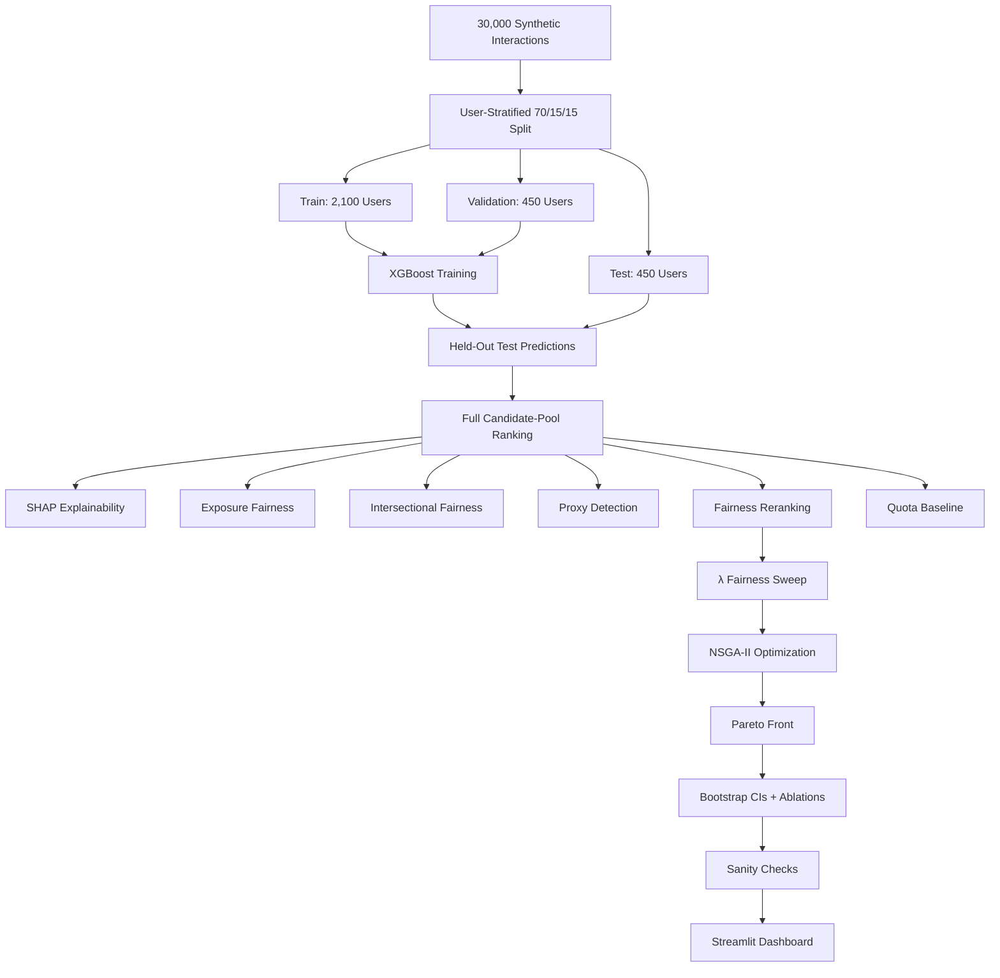

# Fair LinkedIn Recommendation System
deployed link  =  https://fairlinkedin.streamlit.app/
PPT link = https://gamma.app/docs/Fair-LinkedIn-Recommendation-System-jvevron6co034yg

[](https://www.python.org/downloads/)
[](https://xgboost.readthedocs.io/)
[](https://shap.readthedocs.io/)
[](https://en.wikipedia.org/wiki/Non-dominated_sorting_in_genetic_algorithms)
[](https://streamlit.io/)

A research-oriented, bias-aware LinkedIn-style recommendation system combining **XGBoost ranking, SHAP explainability, position-weighted exposure fairness, intersectional fairness, proxy detection, fairness-aware reranking, and genuine NSGA-II multi-objective optimization**.

---

## 📌 Architecture & Methodology



---

# 🔬 Methodology

## 1. Leakage-Free User-Stratified Splitting

The dataset is split by **user**, rather than by individual interaction rows, preventing the same user's interactions from appearing across multiple evaluation partitions.

| Split | Users | Rows | Share |
|---|---:|---:|---:|
| Train | 2,100 | 21,093 | 70.31% |
| Validation | 450 | 4,473 | 14.91% |
| Held-out Test | 450 | 4,434 | 14.78% |

There is **zero user overlap** between splits.

The categorical `OneHotEncoder` is fitted exclusively on `train_df`.

Global configuration is centralized in `src/config.py`, including:

- `RANDOM_SEED = 42`
- `DEFAULT_K = 10`
- Bootstrap iterations = `1,000`
- Minimum intersection size = `30`
- Shared paths and feature definitions

---

## 2. Full Candidate-Pool Recommendation Evaluation

Candidate pools are preserved without premature `.head(10)` or `rank <= 10` truncation.

Complete candidate pools satisfy:

```text
N_u ∈ [1, 24]
```

For each user, recommendation quality is evaluated using:

- Precision@5
- Precision@10
- Recall@5
- Recall@10
- NDCG@5
- NDCG@10

Recall is correctly normalized by the user's total number of relevant items:

$$
Recall@K_u =
\frac{\text{Relevant items retrieved in Top-K}}
{\sum_i y_i}
$$

Users with zero relevant items return `NaN`.

### Repaired Test Metrics

| Metric | Result |
|---|---:|
| NDCG@10 | **0.8086** |
| Recall@10 | **0.9445** |
| Precision@10 | **0.4722** |

---

## 3. XGBoost Baseline

The baseline relevance model is an **XGBoost binary logistic classifier**.

Training uses:

```text
X_train → model fitting
X_val   → early stopping / validation
X_test  → final held-out evaluation
```

---

# ⚖️ Fairness Evaluation

## 4. Position-Weighted Exposure Fairness

The system evaluates actual recommendation exposure rather than relying only on raw prediction probabilities.

Position weight:

$$
w(r)=\frac{1}{\log_2(r+1)}, \qquad r\ge1
$$

Reported metrics include:

- Exposure Disparate Impact (DI)
- Exposure Statistical Parity Difference (SPD)
- Selection Rate DI
- Selection Rate SPD
- Relevance-aware exposure ratios

---

## 5. 3-Way Intersectional Fairness

Intersectional groups are evaluated across:

$$
Gender \times Age \times Location
$$

The repaired analysis evaluates **87 compounded subgroups**.

Sparse groups are retained and flagged:

```text
statistically_unstable = True
```

when:

$$
N < 30
$$

In the audited dataset, **33 subgroups** are flagged as statistically unstable.

---

## 6. Direct Sensitive-Attribute Invariance

The system explicitly tests whether mutating a sensitive attribute changes predictions while modeled features remain unchanged.

The audited test verified:

```text
prediction change = 0.0
```

This demonstrates direct sensitive-attribute invariance, but **does not by itself prove absence of proxy bias**.

---

## 7. Machine-Learning Proxy Detection

Random Forest classifiers attempt to predict sensitive attributes from non-protected features.

Audited ROC-AUC:

| Attribute | ROC-AUC |
|---|---:|
| Gender | **0.5154** |
| Age | **0.4621** |
| Location | **0.4964** |

These classifiers provide an empirical proxy-risk diagnostic.

---

# 🧬 Fairness Mitigation

## 8. Dynamic Candidate-Level Reranking

The previous invariant-ranking behavior was repaired using within-user normalized utility blending:

$$
U(i)=
(1-\lambda)b_{\text{norm}}(i)
+
\lambda f_{\text{norm}}(i)
$$

The fairness utility combines:

| Component | Weight |
|---|---:|
| Candidate network-distance expansion | 0.30 |
| Author-similarity diversity | 0.25 |
| Topic exploration | 0.25 |
| Experience balance | 0.15 |
| Demographic calibration | 0.15 |

Ranking diagnostics identify candidates using:

```text
(user_id, post_id, author_id)
```

This enables explicit measurement of:

- Candidate entry/exit
- Rank displacement
- Score changes
- Top-K composition changes

---

## 9. Greedy Quota Baseline

`run_quota_baseline()` provides a non-optimized baseline targeting demographic representation in Top-K recommendations.

It serves as a comparison against the proposed optimization-based approach.

---

# 🧬 NSGA-II Multi-Objective Optimization

## 10. Genuine Evolutionary Optimization

The system uses a genuine NSGA-II evolutionary optimizer rather than post-hoc grid filtering.

The continuous chromosome is:

$$
(\lambda,w_{\text{exp}},w_{\text{int}},\alpha)
$$

Objectives:

### Objective 1 — Recommendation Quality

$$
f_1=-NDCG@10
$$

### Objective 2 — Exposure Fairness

$$
f_2 =
\left|1-\overline{Exposure\ DI}\right|
$$

### Objective 3 — Intersectional Fairness

$$
f_3 =
1-Worst\ Intersectional\ DI
$$

The optimizer implements:

- Fast non-dominated sorting
- Crowding distance
- Binary tournament selection
- SBX crossover
- Polynomial mutation
- $(\mu+\lambda)$ elitism

Parameters include:

```text
SBX crossover probability = 0.9
Polynomial mutation probability = 0.2
```

The result is a **Pareto front**, not a single universally optimal solution.

---

# 📈 Statistical Validation

## 11. User-Level Bootstrap Confidence Intervals

The system performs:

```text
1,000 bootstrap iterations
```

by resampling **unique users with replacement**.

95% confidence intervals are calculated across **13 quality and fairness metrics**.

User-level resampling preserves the natural clustering of interactions within users.

---

## 12. Five-Way Experimental Comparison

The final comparison evaluates:

1. **XGBoost Baseline**
2. **Naive Reranker**
3. **Quota Baseline**
4. **Intersection-Aware Reranker**
5. **Proposed NSGA-II**

---

# 🧪 Automated Scientific Verification

`src/sanity_checks.py` contains **7 automated assertions** covering:

1. Feature separation
2. Candidate-pool integrity
3. λ = 0.0 baseline equivalence
4. λ = 0.50 ranking modification
5. Top-K bounds
6. Intersectional stability flags
7. Finite metric values

These checks are intended to catch implementation regressions before results are treated as valid experimental outputs.

---

# 📊 Audit & Validation Artifacts

The repository contains additional evidence generated during the repair and validation cycle:

| Artifact | Purpose |
|---|---|
| `results/post_repair_audit.csv` | Formal audit covering `BUG-01` through `BUG-15` |
| `results/reranking_examples.csv` | 25 diverse reranking examples showing candidate entry/exit and rank changes |
| `UPDATE.md` | Full methodological changelog and scientific validation report |

The complete repair history documents changes across the data pipeline, recommendation layer, fairness evaluation, mitigation, optimization, statistical validation, diagnostics, and dashboard. fileciteturn0file0L5-L16

---

# 📁 Repository Structure

```text
linkedin-fair-recommendation/
│
├── data/
│   ├── synthetic_linkedin_dataset_30000.csv
│   ├── synthetic_linkedin_interactions_30000.csv
│   └── synthetic_linkedin_posts_5000.csv
│
├── models/
│   └── xgboost_baseline.pkl
│
├── results/
│   ├── train_split.csv
│   ├── val_split.csv
│   ├── test_split.csv
│   ├── X_train.csv
│   ├── X_val.csv
│   ├── X_test.csv
│   ├── baseline_metrics.csv
│   ├── top_k_metrics.csv
│   ├── exposure_fairness.csv
│   ├── intersectional_fairness_summary.csv
│   ├── proxy_attribute_prediction.csv
│   ├── reranking_diagnostics.csv
│   ├── reranking_examples.csv
│   ├── fairness_strength_results.csv
│   ├── nsga2_pareto_front.csv
│   ├── nsga2_selected_solution.csv
│   ├── ablation_comparison.csv
│   ├── bootstrap_confidence_intervals.csv
│   ├── post_repair_audit.csv
│   └── *.png
│
├── src/
│   ├── config.py
│   ├── data_preprocessing.py
│   ├── recommendation.py
│   ├── top_k_recommender.py
│   ├── shap_analysis.py
│   ├── fairness_analysis.py
│   ├── fairness_mitigation.py
│   ├── intersectional_fairness.py
│   ├── counterfactual_fairness.py
│   ├── fairness_strength_experiment.py
│   ├── nsga2_optimization.py
│   └── sanity_checks.py
│
├── app.py
├── final_comparison.py
├── UPDATE.md
├── requirements.txt
└── README.md
```

---

# 🚀 Execution Guide

## 1. Install Dependencies

```bash
pip install -r requirements.txt
```

## 2. Run the End-to-End Pipeline

```bash
# Step 1: User-stratified 70/15/15 split
python -m src.data_preprocessing

# Step 2: Train XGBoost baseline
python -m src.recommendation

# Step 3: Full candidate-pool recommendation evaluation
python -m src.top_k_recommender

# Step 4: SHAP explainability
python -m src.shap_analysis

# Step 5: Position-weighted fairness analysis
python -m src.fairness_analysis

# Step 6: Fairness reranking + quota baseline
python -m src.fairness_mitigation

# Step 7: Intersectional fairness analysis
python -m src.intersectional_fairness

# Step 8: Direct invariance + proxy detection
python -m src.counterfactual_fairness

# Step 9: λ = 0.0 → 1.0 fairness-strength sweep
python -m src.fairness_strength_experiment

# Step 10: Genuine NSGA-II optimization
python -m src.nsga2_optimization

# Step 11: Final comparison + ablations + bootstrap CIs
python final_comparison.py

# Step 12: Automated scientific sanity checks
python -m src.sanity_checks
```

---

# 🖥️ Streamlit Dashboard

Launch the interactive dashboard:

```bash
streamlit run app.py
```

The dashboard has **12 dynamic tabs** covering current result CSVs and generated figures.

It provides interactive exploration of:

- Recommendation quality
- Fairness metrics
- Exposure distributions
- Intersectional disparities
- Proxy detection
- Reranking behavior
- Fairness-strength experiments
- NSGA-II Pareto solutions
- Bootstrap confidence intervals
- Ablation results

The dashboard was also updated for Python 3.12 syntax compatibility, Streamlit 1.61+ APIs, and Windows CP1252 terminal compatibility. fileciteturn0file0L69-L74

---

# 📋 Configuration Summary

| Configuration | Description | Primary Focus |
|---|---|---|
| **A. XGBoost Baseline** | Unmitigated relevance scoring | Recommendation quality |
| **B. Naive Score Reranker** | Multiplicative demographic scaling | Score calibration |
| **C. Quota Baseline** | Greedy demographic representation target | Representation parity |
| **D. Intersection-Aware** | Subgroup-aware fairness utility | Intersectional disparities |
| **E. Proposed NSGA-II** | Pareto-based multi-objective optimization | Quality–fairness trade-off |

---

# 🔍 Experimental Outputs

### Recommendation Quality

```text
baseline_metrics.csv
top_k_metrics.csv
```

### Exposure Fairness

```text
exposure_fairness.csv
```

### Intersectional Fairness

```text
intersectional_fairness_summary.csv
```

### Proxy Detection

```text
proxy_attribute_prediction.csv
```

### Reranking Diagnostics

```text
reranking_diagnostics.csv
reranking_examples.csv
```

### Fairness Strength

```text
fairness_strength_results.csv
```

### NSGA-II

```text
nsga2_pareto_front.csv
nsga2_selected_solution.csv
```

### Statistical Validation

```text
bootstrap_confidence_intervals.csv
ablation_comparison.csv
```

### Audit

```text
post_repair_audit.csv
```

---

# 🧾 Changed Files

The principal repository changes are:

| File | Status | Main Change |
|---|---|---|
| `src/config.py` | Created | Central configuration and reproducibility controls |
| `src/data_preprocessing.py` | Modified | User-stratified split and train-only encoder fitting |
| `src/recommendation.py` | Modified | XGBoost train/validation/test workflow |
| `src/top_k_recommender.py` | Modified | Full candidate-pool ranking and corrected IR metrics |
| `src/fairness_analysis.py` | Modified | Position-weighted exposure fairness |
| `src/intersectional_fairness.py` | Modified | 2-way/3-way subgroup analysis |
| `src/counterfactual_fairness.py` | Modified | Direct invariance and Random Forest proxy detection |
| `src/fairness_mitigation.py` | Modified | Dynamic reranking and quota baseline |
| `src/fairness_strength_experiment.py` | Modified | 11-step λ sweep |
| `src/nsga2_optimization.py` | Modified | Full NSGA-II evolutionary optimizer |
| `src/sanity_checks.py` | Created | 7 automated scientific assertions |
| `final_comparison.py` | Modified | Five-way comparison and bootstrap CIs |
| `app.py` | Modified | 12-tab Streamlit dashboard and compatibility fixes |
| `README.md` | Modified | Methodology, audit, execution, and validation documentation |
| `UPDATE.md` | Created | Exhaustive repair and verification report |

The underlying repair log confirms these file-level changes and their purposes. fileciteturn0file0L78-L96

---

# ⚖️ Scientific Integrity & Non-Fabrication

The project follows safeguards intended to reduce misleading experimental conclusions:

- No evaluation metrics are manually hard-coded.
- No curves are artificially smoothed.
- Evaluation is performed on held-out test users.
- User overlap between train, validation, and test is prohibited.
- Sparse intersectional groups are flagged rather than silently removed.
- Fairness and recommendation quality are evaluated separately.
- Multiple baseline configurations are compared.
- Bootstrap confidence intervals are generated through empirical resampling.
- Automated sanity checks validate important pipeline invariants.
- Experimental artifacts are persisted as CSV files for inspection.
- Repair evidence is preserved through `post_repair_audit.csv`, `reranking_examples.csv`, and `UPDATE.md`.

---

# ⚠️ Scientific Interpretation

Several distinctions are important:

- **Direct sensitive-attribute invariance is not proof of complete fairness.** Correlated non-protected features can still act as proxies.
- **Exposure parity differs from score parity.** Position affects candidate visibility.
- **Intersectional fairness can be statistically unstable for small groups.** Sparse groups are therefore explicitly flagged.
- **Fairness strength is a trade-off parameter.** A higher λ is not automatically better.
- **NSGA-II produces a Pareto set rather than one universally optimal solution.** Selecting a final point requires an explicit decision criterion.
- **Bootstrap confidence intervals quantify empirical uncertainty but do not remove dataset or modeling bias.**

---

# 🧪 Reproducibility

The project uses:

```python
RANDOM_SEED = 42
```

and centralizes key experimental parameters in `src/config.py`.

The repository preserves the complete experimental trail:

```text
Source Code
    ↓
Data Splitting
    ↓
XGBoost Training
    ↓
Candidate Ranking
    ↓
Fairness Analysis
    ↓
Fairness Reranking
    ↓
NSGA-II Optimization
    ↓
Bootstrap + Ablations
    ↓
Sanity Checks
    ↓
CSV / PNG Artifacts
    ↓
Streamlit Dashboard
```

---

# 🎯 Research Objective

The central objective is to investigate whether **recommendation relevance and fairness can be jointly optimized** rather than treated as isolated evaluation criteria.

The system jointly considers:

$$
\text{Recommendation Relevance}
+
\text{Exposure Fairness}
+
\text{Intersectional Fairness}
$$

through a multi-objective optimization framework.

Rather than claiming a single universally optimal ranking, the NSGA-II stage identifies a **Pareto set of candidate solutions** representing different quality–fairness trade-offs.

---

# 🛠️ Core Technologies

| Component | Technology |
|---|---|
| Language | Python 3.9+ |
| Recommendation Model | XGBoost |
| Explainability | SHAP |
| Fairness | Exposure + Intersectional Metrics |
| Mitigation | Candidate-Level Reranking |
| Optimization | NSGA-II |
| Statistical Validation | User-Level Bootstrap |
| Visualization | Matplotlib / Plotly |
| Dashboard | Streamlit |
| Data | CSV |
| Reproducibility | Random Seed 42 |

---

## 📜 License

Add the project's license here if one has been selected.

---

## 👤 Project

**Fair LinkedIn Recommendation System**

**Recommender Systems · Machine Learning · Explainable AI · Algorithmic Fairness · Intersectional Fairness · Genetic Algorithms · Multi-Objective Optimization**
