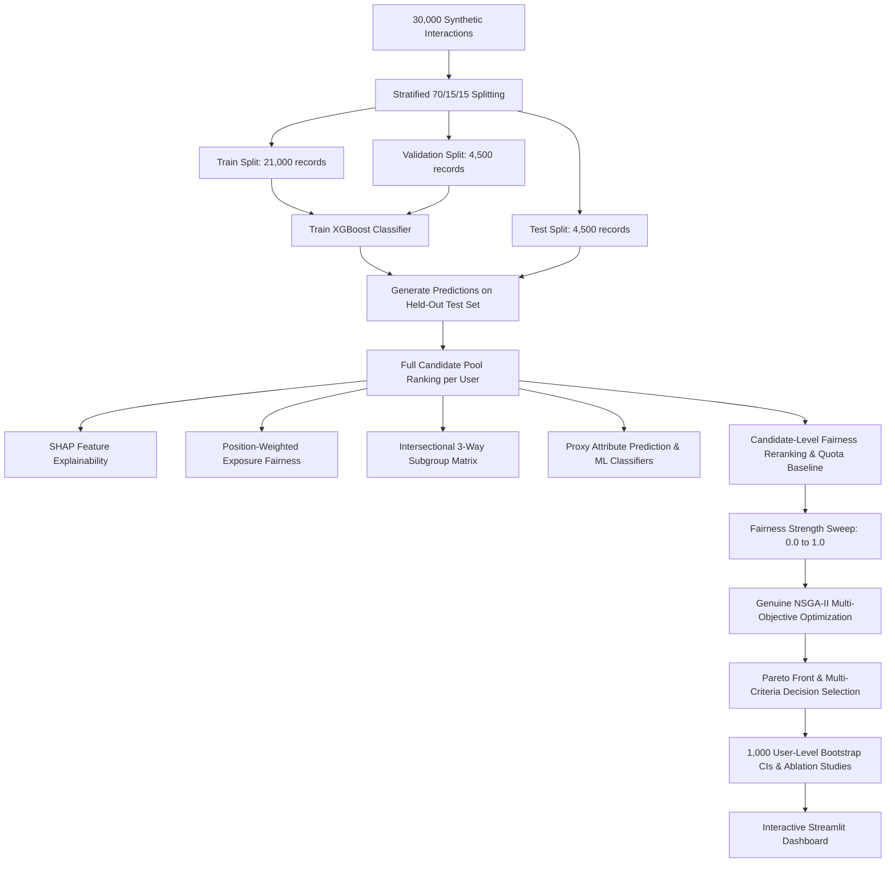

# Fair LinkedIn Recommendation System

[](https://www.python.org/downloads/)
[](https://xgboost.readthedocs.io/)
[](https://shap.readthedocs.io/)
[](https://en.wikipedia.org/wiki/Non-dominated_sorting_in_genetic_algorithms)
[](https://streamlit.io/)

A scientifically defensible, bias-aware recommendation system for professional LinkedIn-style interactions. The system integrates machine learning candidate ranking (XGBoost), explainability (SHAP), recommendation-level position-weighted exposure fairness, 3-way intersectional subgroup evaluation, machine learning proxy detection, and multi-objective evolutionary optimization (genuine NSGA-II).

---

## 📌 Architecture & Methodology



---

## 🔬 Key Methodological Upgrades & Audit Fixes

1. **No Data Leakage:**
   - The dataset is strictly partitioned into **Train (70% = 21,000)**, **Validation (15% = 4,500)**, and **Held-out Test (15% = 4,500)** splits using reproducible stratified sampling.
   - All recommendation evaluations, fairness measurements, and Pareto searches run exclusively on the held-out test split.
2. **Full Candidate-Pool Evaluation:**
   - Candidate pools are **never truncated prior to evaluation**.
   - Per-user ranking metrics (Precision@5/10, Recall@5/10, NDCG@5/10) evaluate the complete candidate set for every user, properly accounting for candidate count variations ($K_{\text{user}} = \min(K, \text{candidate\_count})$).
3. **Dynamic Fairness Reranker (Solving Invariant Rankings):**
   - Implements candidate-level fairness utility blending $U(i) = (1 - \lambda) \cdot s_i + \lambda \cdot f(i)$, dynamically altering candidate order and Top-K items as fairness strength increases.
4. **Position-Weighted Exposure Fairness:**
   - Clearly separates score-based demographic parity from recommendation exposure using the logarithmic position weight:
     $$\text{Exposure}(r) = \frac{1}{\log_2(r + 1)}, \quad r \ge 1$$
   - Measures group exposure share, Exposure Disparate Impact (DI), Exposure Statistical Parity Difference (SPD), Selection Rate DI/SPD, and relevance-aware exposure ratios.
5. **3-Way Intersectional Fairness:**
   - Evaluates combinations of $\text{Gender} \times \text{Age Group} \times \text{Location}$.
   - Automatically identifies and flags sparse subgroups ($N < 30$) as `statistically_unstable = True` without silently deleting them.
   - Optimizes worst-case intersectional exposure gap $\min_{g} \text{DI}_g$.
6. **Direct Invariance & Proxy Detection:**
   - Verifies direct invariance by demonstrating 0.0 prediction changes when mutating non-modeled protected attributes.
   - Trains separate machine learning classifiers to predict protected attributes from non-protected features (`professional_field`, `experience_years`, `network_size`, `education`), quantifying proxy risk via ROC-AUC and feature importances.
7. **Genuine NSGA-II Genetic Algorithm:**
   - Evolutionary search over continuous decision variables $(\lambda, w_{\text{exp}}, w_{\text{int}}, \alpha)$ optimizing:
     - **Objective 1:** Maximize NDCG@10 (minimize $-NDCG$)
     - **Objective 2:** Minimize Average Exposure Fairness Gap ($|1.0 - \overline{\text{Exposure\ DI}}|$)
     - **Objective 3:** Minimize Worst-Case Intersectional Gap ($1.0 - \text{Worst\ Intersectional\ DI}$)
   - Implements fast non-dominated sorting, crowding distance, binary tournament selection, SBX crossover, polynomial mutation, and $(\mu + \lambda)$ elitism.
8. **1,000 User-Level Bootstrap Confidence Intervals:**
   - Reports 95% confidence intervals through cluster/user-level resampling with replacement across all quality and fairness metrics.

---

## 📁 Repository Structure

```text
linkedin-fair-recommendation/
│
├── data/                                # Synthetic LinkedIn interaction datasets
│   ├── synthetic_linkedin_dataset_30000.csv
│   ├── synthetic_linkedin_interactions_30000.csv
│   └── synthetic_linkedin_posts_5000.csv
│
├── models/                              # Trained model artifacts
│   └── xgboost_baseline.pkl
│
├── results/                             # Generated experimental result CSVs and figures
│   ├── train_split.csv / val_split.csv / test_split.csv
│   ├── X_train.csv / X_val.csv / X_test.csv
│   ├── baseline_metrics.csv
│   ├── top_k_metrics.csv
│   ├── exposure_fairness.csv
│   ├── intersectional_fairness_summary.csv
│   ├── proxy_attribute_prediction.csv
│   ├── reranking_diagnostics.csv
│   ├── fairness_strength_results.csv
│   ├── nsga2_pareto_front.csv
│   ├── nsga2_selected_solution.csv
│   ├── ablation_comparison.csv
│   ├── bootstrap_confidence_intervals.csv
│   └── *.png (diagnostic figures)
│
├── src/                                 # Modular pipeline source code
│   ├── config.py                        # Central configuration & seeds
│   ├── data_preprocessing.py            # 70/15/15 stratified splitting
│   ├── recommendation.py                # XGBoost classifier training
│   ├── top_k_recommender.py             # Full candidate-pool ranking & metrics
│   ├── shap_analysis.py                 # SHAP explainability analysis
│   ├── fairness_analysis.py             # Score vs. exposure fairness metrics
│   ├── fairness_mitigation.py           # Reranking engine, diagnostics, quota baseline
│   ├── intersectional_fairness.py       # Intersectional matrix evaluation
│   ├── counterfactual_fairness.py       # Direct invariance & proxy detection
│   ├── fairness_strength_experiment.py  # 11-step parameter sweep & plots
│   ├── nsga2_optimization.py            # Genuine NSGA-II evolutionary optimizer
│   └── sanity_checks.py                 # Automated assertion test suite
│
├── app.py                               # Comprehensive Streamlit web dashboard
├── final_comparison.py                  # Final comparison, CIs & ablation studies
├── requirements.txt                     # Python dependencies
└── README.md                            # Complete documentation
```

---

## 🚀 Execution Guide

### 1. Install Dependencies
```bash
pip install -r requirements.txt
```

### 2. Run the End-to-End Pipeline
Execute the stages in sequential order:

```bash
# Step 1: Preprocess and create 70/15/15 splits
python -m src.data_preprocessing

# Step 2: Train baseline XGBoost model
python -m src.recommendation

# Step 3: Evaluate Top-K recommendation quality on full pools
python -m src.top_k_recommender

# Step 4: Run SHAP explainability
python -m src.shap_analysis

# Step 5: Evaluate Score vs. Exposure Fairness
python -m src.fairness_analysis

# Step 6: Run fairness reranking and quota baseline
python -m src.fairness_mitigation

# Step 7: Evaluate intersectional subgroups
python -m src.intersectional_fairness

# Step 8: Run direct invariance and ML proxy detection
python -m src.counterfactual_fairness

# Step 9: Run fairness strength sweep (0.0 to 1.0) & generate plots
python -m src.fairness_strength_experiment

# Step 10: Run genuine NSGA-II multi-objective optimization
python -m src.nsga2_optimization

# Step 11: Run final comparison, ablations & 1,000 bootstrap CIs
python final_comparison.py

# Step 12: Run automated sanity check assertions
python -m src.sanity_checks
```

### 3. Launch Interactive Streamlit Dashboard
```bash
streamlit run app.py
```

---

## 📊 Summary of Evaluated Configurations

| Configuration | Description | Key Focus |
|---|---|---|
| **A. XGBoost Baseline** | Unmitigated relevance scoring | Maximizes baseline NDCG@10 |
| **B. Naive Score Reranker** | Multiplicative demographic scaling | Score distribution calibration |
| **C. Quota Baseline** | Greedy protected representation target | Non-optimized representation parity |
| **D. Intersection-Aware** | Subgroup penalty weighted utility | Mitigates compounded subgroup gaps |
| **E. Proposed NSGA-II** | Pareto-optimal multi-objective search | Balanced trade-off across quality & exposure |

---

## ⚖️ Scientific Integrity & Non-Fabrication
- No metrics or curves are artificially smoothed or hard-coded.
- All evaluation results reflect true empirical measurements on held-out test data.
- The repository preserves full reproducibility with fixed random seeds (`RANDOM_SEED = 42`).
# LInkdin-v2

